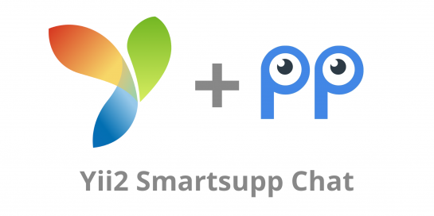

<div style="text-align: center">


</div>


[](https://sonarcloud.io/dashboard?id=tomlutzenberger_yii2-smartsupp-chat)


Yii2 Smartsupp
=====================
Yii2 Widget for Smartsupp Chat

Installation
------------

The preferred way to install this extension is through [composer](http://getcomposer.org/download/).

Either run

```
php composer.phar require --prefer-dist tomlutzenberger/yii2-smartsupp-chat "*"
```

or add

```
"tomlutzenberger/yii2-smartsupp-chat": "*"
```

to the required section of your `composer.json` file.


Usage
-----

Once the extension is installed, simply use it in your code by:

```php
<?= \TomLutzenberger\Smartsupp\SmartsuppChat::widget() ?>
```

You can either add the ID of your container to the `params.php`

```php
<?php
      
return [
    // ...
    'smartsupp' => 'your_key',
];
```

or pass it
directly to the widget: 

```php
<?= \TomLutzenberger\Smartsupp\SmartsuppChat::widget([
    'key' => 'your_key'
]) ?>
```

To be able to use your own triggers you can do this by setting 2 optional parameters:

```php
<?= \TomLutzenberger\Smartsupp\SmartsuppChat::widget([
    'useCustomOpener' => true,
    'useCustomOpenerMobile' => true,
]) ?>
```

For more details see:
- https://docs.smartsupp.com/examples/html-api/
- https://docs.smartsupp.com/javascript-api/

License
-----
This package is published under the MIT License and can be used for any 
commercial and personal projects.
